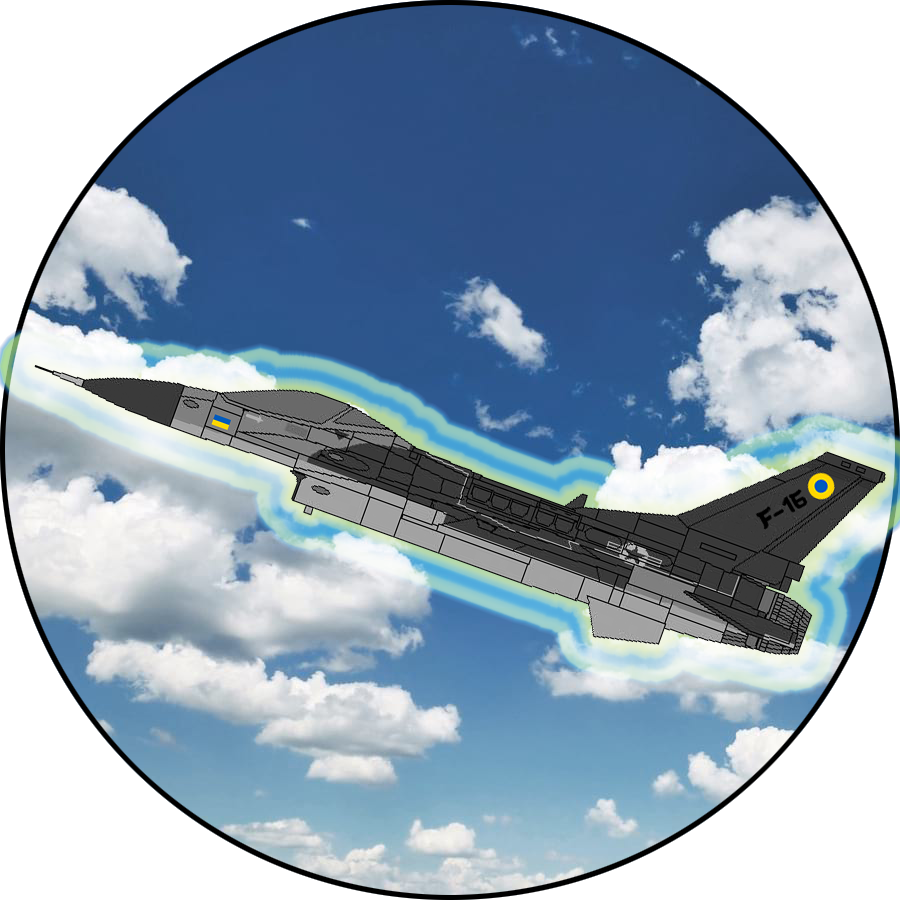
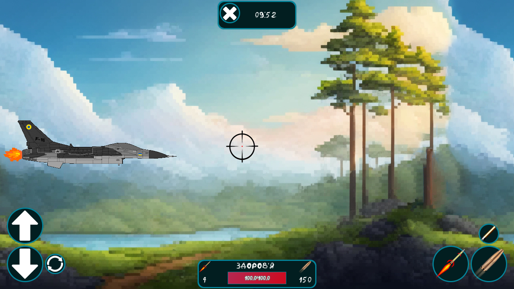
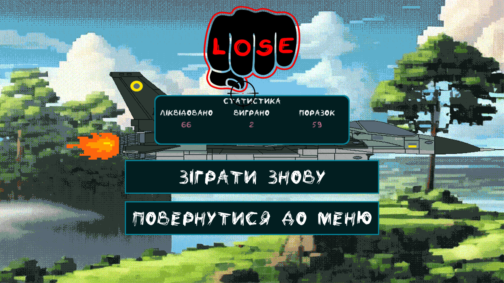
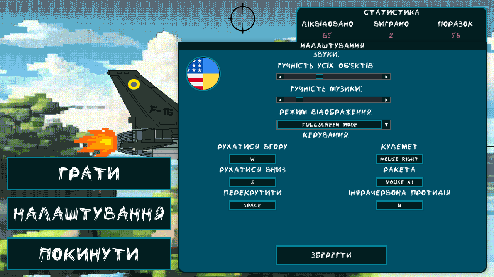
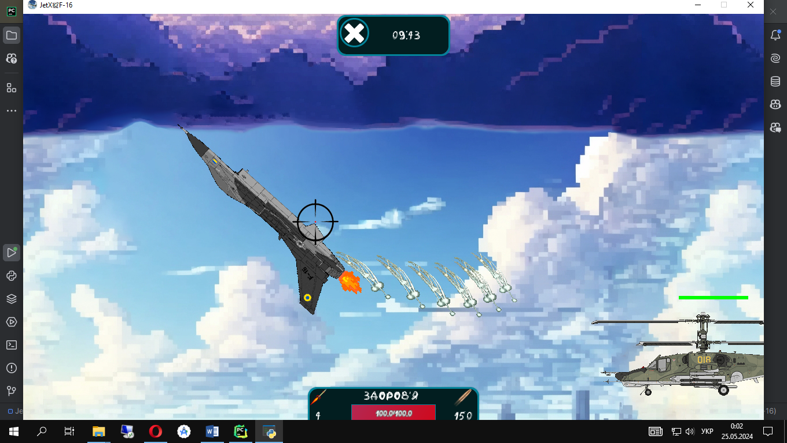

<p align="center"></p>
<h1 align="center">JetX✈F-16</h1>

## Description
<b>EN:</b>

A simple 2D arcade game built using the [**PyGame**](https://www.pygame.org/news) framework. Which closely resembles an air simulator, with flight and weapon mechanics.
This game works on such platforms as: **Windows**, **Linux**, and **Android**.

This is my programming term paper on "Developing games using the [**PyGame**](https://www.pygame.org/news) framework".

<b>UA:</b>

Проста аркадна 2D гра, створена за допомогою фреймворку [**PyGame**](https://www.pygame.org/news). Яка наближено нагадуває авіа-симулятор, з механіками польоту та озброєння.
Ця гра працює на таких платформ як: **Windows**, **Linux**, та **Android**.

Це моя курсова робота з програмування на тему «Розробка ігор з використанням фреймворку [**PyGame**](https://www.pygame.org/news)».

#
## Screenshots:
<p>
  
  
  
  
  
  
</p>

#
## Technologies used
<b>EN:</b>
- Creating a 2D game using the library [**PyGame**](https://www.pygame.org)
- Creation of the user interface of the game using the library [**PyGame-GUI**](https://pygame-gui.readthedocs.io)
- Using the [**OpenCV-Python**](https://pypi.org/project/opencv-python/) library to download and process **GIF** images.
- Working with the **JSON** format
- Working with mathematical game models
- Creation of own system of game locations
- Advanced game settings
- Different behaviors on different platforms
- Creation of game console commands
- Multi streaming

<b>UA:</b>
- Створення 2D гри за допомогою бібліотеки [**PyGame**](https://www.pygame.org)
- Створення користувацького інтерфейсу гри за допомогою бібліотеки [**PyGame-GUI**](https://pygame-gui.readthedocs.io)
- Використання бібліотеки [**OpenCV-Python**](https://pypi.org/project/opencv-python/) для завантаження та обробки **GIF**-зображень.
- Робота з форматом **JSON**
- Робота з математичними моделями гри
- Створення власної системи ігрових локацій
- Розширені налаштування гри
- Різні поведінки на різних платформах
- Створення консольних команд гри
- Багато потоковість

#
## License
```
© 2024, CoolOtaku (ericspz531@gmail.com)
```
